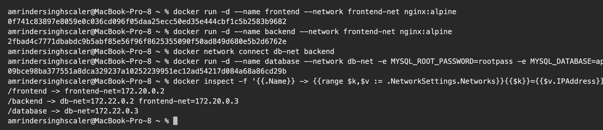
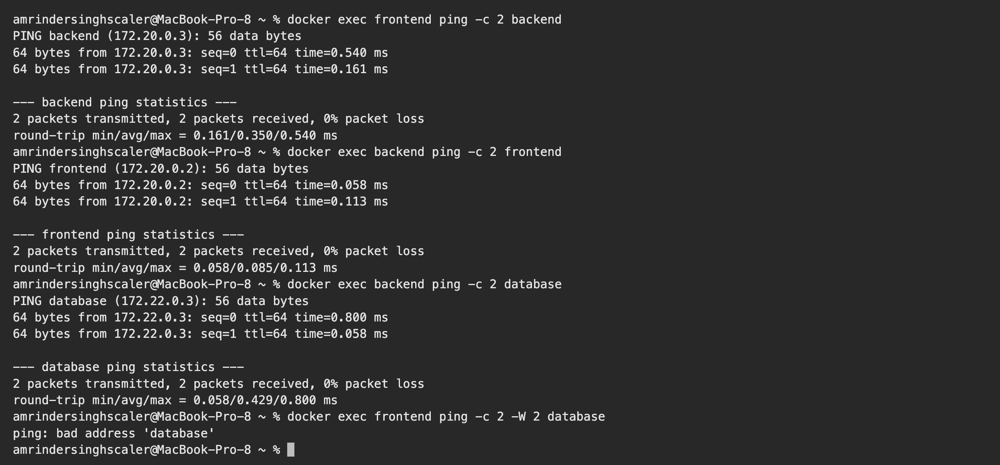
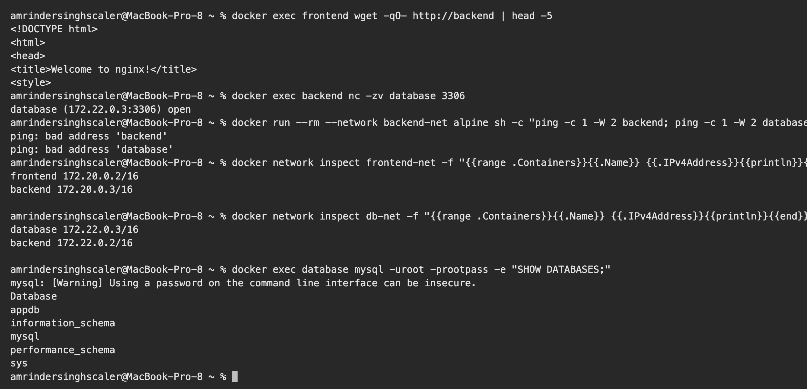
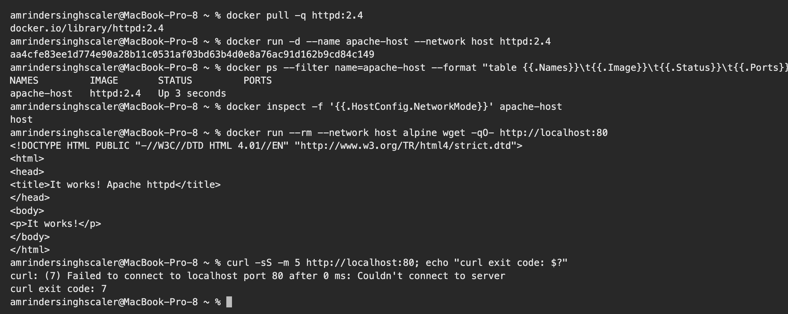
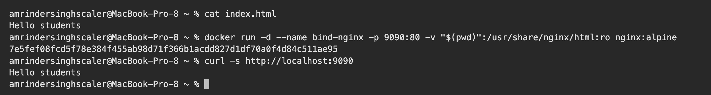
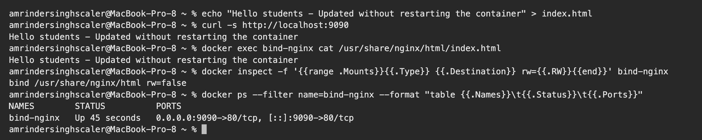

# Docker Networking & Volumes – Homework

**Name:** Vivek Solanki
**Roll No:** 24BCS10338

All outputs are copied from my terminal (Docker Desktop on macOS).

---

## Task 1: Docker container networking

**Goal:** 3 containers (frontend, backend, database), 3 networks, backend attached to 2 networks, then check connectivity.

### Design

```text
   frontend-net                 db-net                  backend-net
+----------------+        +----------------+        +----------------+
| frontend       |        | database       |        | (no app here,  |
| backend  <-----+--------+-> backend      |        |  used to prove |
+----------------+        +----------------+        |  isolation)    |
                                                    +----------------+
```

- `frontend` (nginx:alpine) → `frontend-net`
- `backend` (nginx:alpine) → `frontend-net` **and** `db-net` (2 networks)
- `database` (mysql:8.0) → `db-net`
- `backend-net` is the third network. A throw-away container is started on it to show that a container on a different network cannot reach the others.

This is the usual 3-tier idea: the frontend must never talk to the database directly, only the backend can.

### Create the networks and containers

Image pull progress lines are removed from the output.

```text
$ docker network create frontend-net
50b449cf737d6117f10dcb96f3ba699fd147ac7fcb78cb8a9b0fe46732225749

$ docker network create backend-net
106c04d2ac1913c9b46a2f9843c7cf9f674ed11cf3352b9d6744e75cf848bf0d

$ docker network create db-net
08aee09f515ee7d5ac8ea6b54ceec56c1e181c38c212d2e73ff4ae74c314afc1

$ docker network ls --filter name=-net
NETWORK ID     NAME           DRIVER    SCOPE
106c04d2ac19   backend-net    bridge    local
08aee09f515e   db-net         bridge    local
50b449cf737d   frontend-net   bridge    local


$ docker run -d --name frontend --network frontend-net nginx:alpine
0f741c83897e8059e0c036cd096f05daa25ecc50ed35e444cbf1c5b2583b9682

$ docker run -d --name backend --network frontend-net nginx:alpine
2fbad4c7771dbabdc9b5abf85e56f96f8625355090f50ad849d680e5b2d6762e

$ docker network connect db-net backend

$ docker run -d --name database --network db-net -e MYSQL_ROOT_PASSWORD=rootpass -e MYSQL_DATABASE=appdb mysql:8.0
09bce98ba377551a8dca329237a10252239951ec12ad54217d084a68a86cd29b

$ docker inspect -f '{{.Name}} -> {{range $k,$v := .NetworkSettings.Networks}}{{$k}}={{$v.IPAddress}} {{end}}' frontend backend database
/frontend -> frontend-net=172.20.0.2 
/backend -> db-net=172.22.0.2 frontend-net=172.20.0.3 
/database -> db-net=172.22.0.3 
```

### Check connectivity

```text
$ docker exec frontend ping -c 2 backend
PING backend (172.20.0.3): 56 data bytes
64 bytes from 172.20.0.3: seq=0 ttl=64 time=0.540 ms
64 bytes from 172.20.0.3: seq=1 ttl=64 time=0.161 ms

--- backend ping statistics ---
2 packets transmitted, 2 packets received, 0% packet loss
round-trip min/avg/max = 0.161/0.350/0.540 ms

$ docker exec backend ping -c 2 frontend
PING frontend (172.20.0.2): 56 data bytes
64 bytes from 172.20.0.2: seq=0 ttl=64 time=0.058 ms
64 bytes from 172.20.0.2: seq=1 ttl=64 time=0.113 ms

--- frontend ping statistics ---
2 packets transmitted, 2 packets received, 0% packet loss
round-trip min/avg/max = 0.058/0.085/0.113 ms

$ docker exec backend ping -c 2 database
PING database (172.22.0.3): 56 data bytes
64 bytes from 172.22.0.3: seq=0 ttl=64 time=0.800 ms
64 bytes from 172.22.0.3: seq=1 ttl=64 time=0.058 ms

--- database ping statistics ---
2 packets transmitted, 2 packets received, 0% packet loss
round-trip min/avg/max = 0.058/0.429/0.800 ms

$ docker exec frontend ping -c 2 -W 2 database
ping: bad address 'database'


$ docker exec frontend wget -qO- http://backend | head -5
<!DOCTYPE html>
<html>
<head>
<title>Welcome to nginx!</title>
<style>

$ docker exec backend nc -zv database 3306
database (172.22.0.3:3306) open

$ docker run --rm --network backend-net alpine sh -c "ping -c 1 -W 2 backend; ping -c 1 -W 2 database"
ping: bad address 'backend'
ping: bad address 'database'

$ docker network inspect frontend-net -f "{{range .Containers}}{{.Name}} {{.IPv4Address}}{{println}}{{end}}"
frontend 172.20.0.2/16
backend 172.20.0.3/16


$ docker network inspect db-net -f "{{range .Containers}}{{.Name}} {{.IPv4Address}}{{println}}{{end}}"
database 172.22.0.3/16
backend 172.22.0.2/16


$ docker exec database mysql -uroot -prootpass -e "SHOW DATABASES;"
mysql: [Warning] Using a password on the command line interface can be insecure.
Database
appdb
information_schema
mysql
performance_schema
sys
```

### Screenshots

Networks created:


Containers, with `backend` on two networks:



Ping tests (frontend → database fails as expected):



HTTP, MySQL port and isolation tests:



### Result

| From → To | Result | Why |
|---|---|---|
| frontend → backend | Works | Both are on `frontend-net` |
| backend → frontend | Works | Both are on `frontend-net` |
| backend → database (ping and port 3306) | Works | Both are on `db-net` |
| frontend → database | **Fails** (`bad address`) | No shared network, so not even the name resolves |
| container on `backend-net` → backend / database | **Fails** | Different network, fully isolated |

### What I understood

- User-defined bridge networks have a built-in DNS server, so containers reach each other by **container name**. The default `bridge` network does not do this.
- A container can join several networks with `docker network connect`. It then gets one IP per network (`backend` has `172.20.0.3` and `172.22.0.2`).
- Networks are isolation boundaries. Two containers can only talk if they share at least one network.

Clean up:

```bash
docker rm -f frontend backend database
docker network rm frontend-net backend-net db-net
```

---

## Task 2: Host network

**Goal:** run Apache with `--network host` and access it directly on port 80, without `-p`.

```text
$ docker pull -q httpd:2.4
docker.io/library/httpd:2.4

$ docker run -d --name apache-host --network host httpd:2.4
aa4cfe83ee1d774e90a28b11c0531af03bd63b4d0e8a76ac91d162b9cd84c149

$ docker ps --filter name=apache-host --format "table {{.Names}}\t{{.Image}}\t{{.Status}}\t{{.Ports}}"
NAMES         IMAGE       STATUS         PORTS
apache-host   httpd:2.4   Up 3 seconds   

$ docker inspect -f '{{.HostConfig.NetworkMode}}' apache-host
host
```

`PORTS` is empty because nothing is published. With the host network the container shares the network stack of the Docker host, so Apache binds straight to port 80 of the host.

### Accessing the website on port 80

```text
$ docker run --rm --network host alpine wget -qO- http://localhost:80
<!DOCTYPE HTML PUBLIC "-//W3C//DTD HTML 4.01//EN" "http://www.w3.org/TR/html4/strict.dtd">
<html>
<head>
<title>It works! Apache httpd</title>
</head>
<body>
<p>It works!</p>
</body>
</html>
```

Apache answered with **It works!** on `localhost:80` of the Docker host, with no port mapping.

### An important detail on macOS

```text
$ curl -sS -m 5 http://localhost:80; echo "curl exit code: $?"
curl: (7) Failed to connect to localhost port 80 after 0 ms: Couldn't connect to server
curl exit code: 7
```

From the macOS terminal the same URL is refused. On macOS (and Windows) Docker runs inside a small Linux virtual machine, so with `--network host` the "host" is that **Linux VM, not my Mac**. That is why I tested from a second container that also uses the host network. On a real Linux machine `curl http://localhost:80` works directly from the terminal and the browser. Newer Docker Desktop versions also have an optional "Enable host networking" setting that forwards these ports to the Mac.

### Screenshot



### What I understood

- `--network host` removes network isolation. There is no separate container IP, no NAT, and `-p` is ignored.
- It is slightly faster and useful for monitoring agents, but two containers cannot both use the same port, and it is less secure.

---

## Task 3: Bind mount

**Goal:** serve a local folder through Nginx and see edits live without restarting the container.

Folder: [bind-mount](bind-mount) containing `index.html`.

```text
$ cat index.html
Hello students

$ docker run -d --name bind-nginx -p 9090:80 -v "$(pwd)":/usr/share/nginx/html:ro nginx:alpine
7e5fef08fcd5f78e384f455ab98d71f366b1acdd827d1df70a0f4d84c511ae95

$ curl -s http://localhost:9090
Hello students


$ echo "Hello students - Updated without restarting the container" > index.html

$ curl -s http://localhost:9090
Hello students - Updated without restarting the container

$ docker exec bind-nginx cat /usr/share/nginx/html/index.html
Hello students - Updated without restarting the container

$ docker inspect -f '{{range .Mounts}}{{.Type}} {{.Destination}} rw={{.RW}}{{end}}' bind-nginx
bind /usr/share/nginx/html rw=false

$ docker ps --filter name=bind-nginx --format "table {{.Names}}\t{{.Status}}\t{{.Ports}}"
NAMES        STATUS          PORTS
bind-nginx   Up 45 seconds   0.0.0.0:9090->80/tcp, [::]:9090->80/tcp
```

### Screenshots

Container started with the bind mount:



Browser at `http://localhost:9090` before the edit:


File edited on the laptop, container not restarted:



Browser after the edit:


### What I understood

- `-v "$(pwd)":/usr/share/nginx/html:ro` mounts my local folder over the Nginx web root. `:ro` makes it read-only inside the container (`rw=false`).
- After I edited `index.html` on my laptop, the next `curl` returned the new text, and the container status still shows the same uptime. **No rebuild and no restart.**
- Bind mounts are ideal for development. For data that must survive and be managed by Docker (databases), named **volumes** (`docker volume create`) are preferred because they do not depend on a path on the host.
- One thing I noticed: a request sent in the same instant as the file save once returned a cut-off page, because file changes take a moment to sync from macOS into the Docker VM. A second later the full new content was served.

---

## Task 4: Overlay network (research)

### What it is

An overlay network is a virtual network that spans **multiple Docker hosts**. Containers on different machines get IPs from the same subnet and talk to each other as if they were on one local network.

### How it works across hosts

- It needs a cluster, normally **Docker Swarm** (`docker swarm init` on the manager, `docker swarm join` on the workers).
- Traffic between hosts is wrapped using **VXLAN**: the container's packet is placed inside a UDP packet (port 4789), sent over the normal network to the other host, and unwrapped there.
- Swarm nodes share network state over TCP 2377 (cluster management) and TCP/UDP 7946 (node discovery).
- Every overlay network has built-in DNS, so services are reached by service name, and Swarm load balances across replicas through a virtual IP.
- Swarm creates a default overlay called `ingress` for published ports (routing mesh): a published port answers on every node, even on nodes not running the container.
- Traffic can be encrypted with `--opt encrypted`.

### Commands

```bash
docker swarm init
docker network create -d overlay --attachable my-overlay
docker service create --name web --network my-overlay --replicas 3 nginx
docker network ls --filter driver=overlay
```

`--attachable` allows standalone containers, not only Swarm services, to join the network.

### Use cases

- Microservices spread over several servers that must reach each other by name.
- Scaling one service across many hosts behind a single service name.
- High availability: a container can be rescheduled to another host and keeps working with the same service name.

### Bridge vs host vs overlay

| Driver | Scope | Isolation | Typical use |
|---|---|---|---|
| `bridge` | One host | Yes, per network | Default, multi-container apps on one machine |
| `host` | One host | None | Maximum network performance, monitoring agents |
| `overlay` | Many hosts | Yes, per network | Swarm services across a cluster |
| `none` | – | Total | Containers that need no network |
