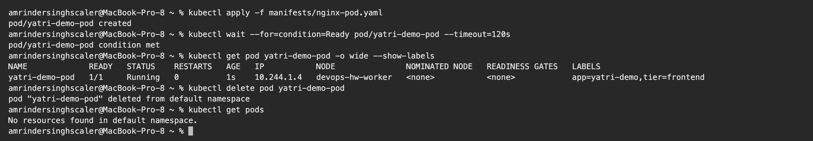
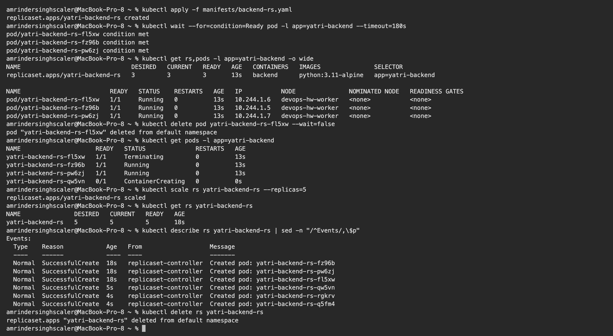
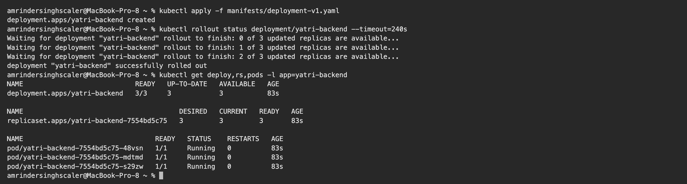
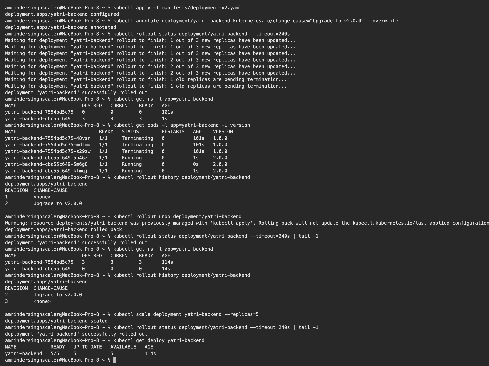
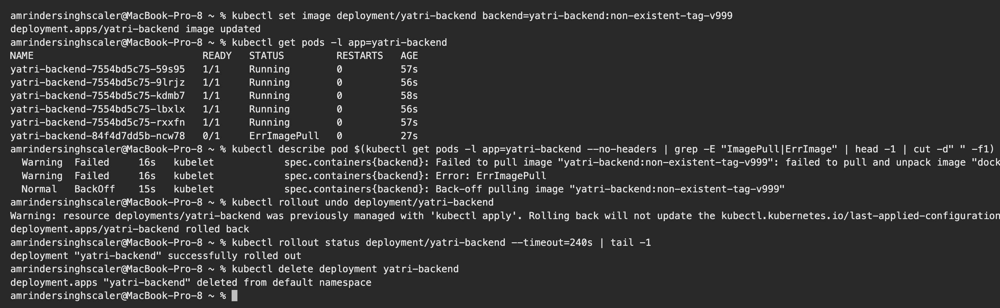
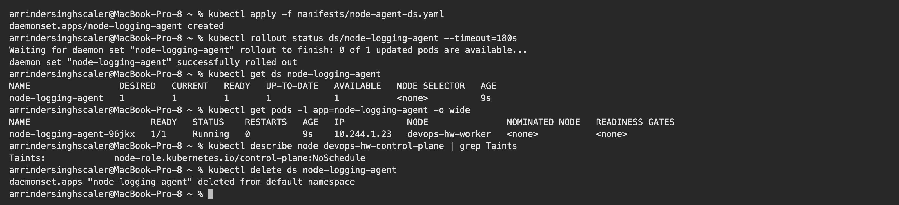

# Kubernetes Pods, ReplicaSets & Deployments – Homework

**Name:** Vivek Solanki
**Roll No:** 24BCS10338

Manifests are from the class repository ([session10-k8s-core-objects](https://github.com/Nency-Ravaliya/devops-heros/tree/main/session10-k8s-core-objects)) and are copied into [manifests/](manifests). I ran them on my local 2-node kind cluster. All outputs are copied from my terminal.

| Object | What it adds |
|---|---|
| **Pod** | Smallest unit: one or more containers sharing an IP and volumes. If it dies, nothing brings it back |
| **ReplicaSet** | Keeps N copies of a Pod running at all times (self-healing, scaling) |
| **Deployment** | Manages ReplicaSets to give rolling updates, history and rollback |
| **DaemonSet** | Runs exactly one Pod on every (eligible) node |

---

## 1. Pod

[manifests/nginx-pod.yaml](manifests/nginx-pod.yaml)

```text
$ kubectl apply -f manifests/nginx-pod.yaml
pod/yatri-demo-pod created

$ kubectl wait --for=condition=Ready pod/yatri-demo-pod --timeout=120s
pod/yatri-demo-pod condition met

$ kubectl get pod yatri-demo-pod -o wide --show-labels
NAME             READY   STATUS    RESTARTS   AGE   IP           NODE               NOMINATED NODE   READINESS GATES   LABELS
yatri-demo-pod   1/1     Running   0          1s    10.244.1.4   devops-hw-worker   <none>           <none>            app=yatri-demo,tier=frontend

$ kubectl delete pod yatri-demo-pod
pod "yatri-demo-pod" deleted from default namespace

$ kubectl get pods
No resources found in default namespace.
```

**What I understood:** a bare Pod is not protected. After `kubectl delete pod` there were **no resources** left, nobody re-created it. That is why Pods are almost never created directly in production.

## 2. ReplicaSet – self-healing and scaling

[manifests/backend-rs.yaml](manifests/backend-rs.yaml) asks for `replicas: 3` with the selector `app=yatri-backend`.

```text
$ kubectl apply -f manifests/backend-rs.yaml
replicaset.apps/yatri-backend-rs created

$ kubectl wait --for=condition=Ready pod -l app=yatri-backend --timeout=180s
pod/yatri-backend-rs-fl5xw condition met
pod/yatri-backend-rs-fz96b condition met
pod/yatri-backend-rs-pw6zj condition met

$ kubectl get rs,pods -l app=yatri-backend -o wide
NAME                               DESIRED   CURRENT   READY   AGE   CONTAINERS   IMAGES               SELECTOR
replicaset.apps/yatri-backend-rs   3         3         3       13s   backend      python:3.11-alpine   app=yatri-backend

NAME                         READY   STATUS    RESTARTS   AGE   IP           NODE               NOMINATED NODE   READINESS GATES
pod/yatri-backend-rs-fl5xw   1/1     Running   0          13s   10.244.1.6   devops-hw-worker   <none>           <none>
pod/yatri-backend-rs-fz96b   1/1     Running   0          13s   10.244.1.5   devops-hw-worker   <none>           <none>
pod/yatri-backend-rs-pw6zj   1/1     Running   0          13s   10.244.1.7   devops-hw-worker   <none>           <none>

$ kubectl delete pod yatri-backend-rs-fl5xw --wait=false
pod "yatri-backend-rs-fl5xw" deleted from default namespace

$ kubectl get pods -l app=yatri-backend
NAME                     READY   STATUS              RESTARTS   AGE
yatri-backend-rs-fl5xw   1/1     Terminating         0          13s
yatri-backend-rs-fz96b   1/1     Running             0          13s
yatri-backend-rs-pw6zj   1/1     Running             0          13s
yatri-backend-rs-qw5vn   0/1     ContainerCreating   0          0s

$ kubectl scale rs yatri-backend-rs --replicas=5
replicaset.apps/yatri-backend-rs scaled

$ kubectl get rs yatri-backend-rs
NAME               DESIRED   CURRENT   READY   AGE
yatri-backend-rs   5         5         5       18s

$ kubectl describe rs yatri-backend-rs | sed -n "/^Events/,\$p"
Events:
  Type    Reason            Age   From                   Message
  ----    ------            ----  ----                   -------
  Normal  SuccessfulCreate  18s   replicaset-controller  Created pod: yatri-backend-rs-fz96b
  Normal  SuccessfulCreate  18s   replicaset-controller  Created pod: yatri-backend-rs-pw6zj
  Normal  SuccessfulCreate  18s   replicaset-controller  Created pod: yatri-backend-rs-fl5xw
  Normal  SuccessfulCreate  5s    replicaset-controller  Created pod: yatri-backend-rs-qw5vn
  Normal  SuccessfulCreate  4s    replicaset-controller  Created pod: yatri-backend-rs-rgkrv
  Normal  SuccessfulCreate  4s    replicaset-controller  Created pod: yatri-backend-rs-q5fm4

$ kubectl delete rs yatri-backend-rs
replicaset.apps "yatri-backend-rs" deleted from default namespace
```

**What I understood:**

- I deleted the Pod `yatri-backend-rs-fl5xw`. The ReplicaSet had already created a replacement (`yatri-backend-rs-qw5vn`, still `ContainerCreating`) in the same instant that the old one went to `Terminating`. The count never stays below 3.
- The ReplicaSet finds its Pods only through the **label selector**, and Pod names get a random suffix.
- `kubectl scale --replicas=5` created 2 more Pods. The `Events` list shows every `SuccessfulCreate`.
- A ReplicaSet cannot do a controlled image update. That is the job of a Deployment.

## 3. Deployment – rolling update, history, rollback

[manifests/deployment-v1.yaml](manifests/deployment-v1.yaml) → [manifests/deployment-v2.yaml](manifests/deployment-v2.yaml)

```text
$ kubectl apply -f manifests/deployment-v1.yaml
deployment.apps/yatri-backend created

$ kubectl rollout status deployment/yatri-backend --timeout=240s
Waiting for deployment "yatri-backend" rollout to finish: 0 of 3 updated replicas are available...
Waiting for deployment "yatri-backend" rollout to finish: 1 of 3 updated replicas are available...
Waiting for deployment "yatri-backend" rollout to finish: 2 of 3 updated replicas are available...
deployment "yatri-backend" successfully rolled out

$ kubectl get deploy,rs,pods -l app=yatri-backend
NAME                            READY   UP-TO-DATE   AVAILABLE   AGE
deployment.apps/yatri-backend   3/3     3            3           83s

NAME                                       DESIRED   CURRENT   READY   AGE
replicaset.apps/yatri-backend-7554bd5c75   3         3         3       83s

NAME                                 READY   STATUS    RESTARTS   AGE
pod/yatri-backend-7554bd5c75-48vsn   1/1     Running   0          83s
pod/yatri-backend-7554bd5c75-mdtmd   1/1     Running   0          83s
pod/yatri-backend-7554bd5c75-s29zw   1/1     Running   0          83s


$ kubectl apply -f manifests/deployment-v2.yaml
deployment.apps/yatri-backend configured

$ kubectl annotate deployment/yatri-backend kubernetes.io/change-cause="Upgrade to v2.0.0" --overwrite
deployment.apps/yatri-backend annotated

$ kubectl rollout status deployment/yatri-backend --timeout=240s
Waiting for deployment "yatri-backend" rollout to finish: 1 out of 3 new replicas have been updated...
Waiting for deployment "yatri-backend" rollout to finish: 1 out of 3 new replicas have been updated...
Waiting for deployment "yatri-backend" rollout to finish: 1 out of 3 new replicas have been updated...
Waiting for deployment "yatri-backend" rollout to finish: 2 out of 3 new replicas have been updated...
Waiting for deployment "yatri-backend" rollout to finish: 2 out of 3 new replicas have been updated...
Waiting for deployment "yatri-backend" rollout to finish: 2 out of 3 new replicas have been updated...
Waiting for deployment "yatri-backend" rollout to finish: 1 old replicas are pending termination...
Waiting for deployment "yatri-backend" rollout to finish: 1 old replicas are pending termination...
deployment "yatri-backend" successfully rolled out

$ kubectl get rs -l app=yatri-backend
NAME                       DESIRED   CURRENT   READY   AGE
yatri-backend-7554bd5c75   0         0         0       101s
yatri-backend-cbc55c649    3         3         3       1s

$ kubectl get pods -l app=yatri-backend -L version
NAME                             READY   STATUS        RESTARTS   AGE    VERSION
yatri-backend-7554bd5c75-48vsn   1/1     Terminating   0          101s   1.0.0
yatri-backend-7554bd5c75-mdtmd   1/1     Terminating   0          101s   1.0.0
yatri-backend-7554bd5c75-s29zw   1/1     Terminating   0          101s   1.0.0
yatri-backend-cbc55c649-5b46z    1/1     Running       0          1s     2.0.0
yatri-backend-cbc55c649-5m6g8    1/1     Running       0          0s     2.0.0
yatri-backend-cbc55c649-klmqj    1/1     Running       0          1s     2.0.0

$ kubectl rollout history deployment/yatri-backend
deployment.apps/yatri-backend 
REVISION  CHANGE-CAUSE
1         <none>
2         Upgrade to v2.0.0


$ kubectl rollout undo deployment/yatri-backend
Warning: resource deployments/yatri-backend was previously managed with 'kubectl apply'. Rolling back will not update the kubectl.kubernetes.io/last-applied-configuration annotation, which may cause unexpected behavior on future 'kubectl apply' operations. Consider using 'kubectl apply' with your previous configuration file instead.
deployment.apps/yatri-backend rolled back

$ kubectl rollout status deployment/yatri-backend --timeout=240s | tail -1
deployment "yatri-backend" successfully rolled out

$ kubectl get rs -l app=yatri-backend
NAME                       DESIRED   CURRENT   READY   AGE
yatri-backend-7554bd5c75   3         3         3       114s
yatri-backend-cbc55c649    0         0         0       14s

$ kubectl rollout history deployment/yatri-backend
deployment.apps/yatri-backend 
REVISION  CHANGE-CAUSE
2         Upgrade to v2.0.0
3         <none>


$ kubectl scale deployment yatri-backend --replicas=5
deployment.apps/yatri-backend scaled

$ kubectl rollout status deployment/yatri-backend --timeout=240s | tail -1
deployment "yatri-backend" successfully rolled out

$ kubectl get deploy yatri-backend
NAME            READY   UP-TO-DATE   AVAILABLE   AGE
yatri-backend   5/5     5            5           114s
```

**What I understood:**

- The chain is **Deployment → ReplicaSet → Pods**. The Pod name shows it: `yatri-backend` + ReplicaSet hash `7554bd5c75` + Pod suffix.
- Applying v2 created a **new ReplicaSet** (`cbc55c649`) and scaled it up while the old one (`7554bd5c75`) was scaled down to 0. `rollout status` shows it happening one replica at a time. With `maxSurge: 1` and `maxUnavailable: 0`, a new Pod must be ready before an old one is removed, so there is no downtime.
- The old ReplicaSet is kept with 0 replicas. That is what makes rollback instant: `kubectl rollout undo` simply scaled `7554bd5c75` back to 3.
- After the undo, revision 1 became revision 3 in `rollout history`. A rollback is recorded as a new revision.
- The `kubernetes.io/change-cause` annotation fills the `CHANGE-CAUSE` column, which is useful to know why a release was made.

## 4. Troubleshooting – a broken image

I pushed a wrong image tag on purpose, the same error as in `troubleshooting/broken-image.yaml`.

```text
$ kubectl set image deployment/yatri-backend backend=yatri-backend:non-existent-tag-v999
deployment.apps/yatri-backend image updated

$ kubectl get pods -l app=yatri-backend
NAME                             READY   STATUS         RESTARTS   AGE
yatri-backend-7554bd5c75-59s95   1/1     Running        0          57s
yatri-backend-7554bd5c75-9lrjz   1/1     Running        0          56s
yatri-backend-7554bd5c75-kdmb7   1/1     Running        0          58s
yatri-backend-7554bd5c75-lbxlx   1/1     Running        0          56s
yatri-backend-7554bd5c75-rxxfn   1/1     Running        0          57s
yatri-backend-84f4d7dd5b-ncw78   0/1     ErrImagePull   0          27s

$ kubectl describe pod $(kubectl get pods -l app=yatri-backend --no-headers | grep -E "ImagePull|ErrImage" | head -1 | cut -d" " -f1) | grep -E "Failed|Back-off" | head -3
  Warning  Failed     16s   kubelet            spec.containers{backend}: Failed to pull image "yatri-backend:non-existent-tag-v999": failed to pull and unpack image "docker.io/library/yatri-backend:non-existent-tag-v999": failed to resolve reference "docker.io/library/yatri-backend:non-existent-tag-v999": pull access denied, repository does not exist or may require authorization: server message: insufficient_scope: authorization failed
  Warning  Failed     16s   kubelet            spec.containers{backend}: Error: ErrImagePull
  Normal   BackOff    15s   kubelet            spec.containers{backend}: Back-off pulling image "yatri-backend:non-existent-tag-v999"

$ kubectl rollout undo deployment/yatri-backend
Warning: resource deployments/yatri-backend was previously managed with 'kubectl apply'. Rolling back will not update the kubectl.kubernetes.io/last-applied-configuration annotation, which may cause unexpected behavior on future 'kubectl apply' operations. Consider using 'kubectl apply' with your previous configuration file instead.
deployment.apps/yatri-backend rolled back

$ kubectl rollout status deployment/yatri-backend --timeout=240s | tail -1
deployment "yatri-backend" successfully rolled out

$ kubectl delete deployment yatri-backend
deployment.apps "yatri-backend" deleted from default namespace
```

**What I understood:**

- The new Pod went to `ErrImagePull`, and then to `ImagePullBackOff` once the kubelet started backing off between retries. `kubectl describe pod` gave the exact reason: the image could not be pulled.
- The rolling update **protected the application**. All 5 old Pods stayed `Running` because the new Pod never became ready, so Kubernetes did not remove any more old ones.
- `kubectl rollout undo` brought the Deployment back to the healthy version.

Debugging order: `kubectl get pods` → `kubectl describe pod` (Events) → `kubectl logs` (add `--previous` for `CrashLoopBackOff`).

## 5. DaemonSet

[manifests/node-agent-ds.yaml](manifests/node-agent-ds.yaml)

```text
$ kubectl apply -f manifests/node-agent-ds.yaml
daemonset.apps/node-logging-agent created

$ kubectl rollout status ds/node-logging-agent --timeout=180s
Waiting for daemon set "node-logging-agent" rollout to finish: 0 of 1 updated pods are available...
daemon set "node-logging-agent" successfully rolled out

$ kubectl get ds node-logging-agent
NAME                 DESIRED   CURRENT   READY   UP-TO-DATE   AVAILABLE   NODE SELECTOR   AGE
node-logging-agent   1         1         1       1            1           <none>          9s

$ kubectl get pods -l app=node-logging-agent -o wide
NAME                       READY   STATUS    RESTARTS   AGE   IP            NODE               NOMINATED NODE   READINESS GATES
node-logging-agent-96jkx   1/1     Running   0          9s    10.244.1.23   devops-hw-worker   <none>           <none>

$ kubectl describe node devops-hw-control-plane | grep Taints
Taints:             node-role.kubernetes.io/control-plane:NoSchedule

$ kubectl delete ds node-logging-agent
daemonset.apps "node-logging-agent" deleted from default namespace
```

**What I understood:** there is no `replicas` field. The number of Pods follows the number of nodes. `DESIRED` is 1 on my 2-node cluster because the control-plane node has a `NoSchedule` taint and this DaemonSet has no toleration for it, so only the worker node is eligible. Typical uses are log collectors, monitoring agents and network plugins. `kube-proxy` and `kindnet` are DaemonSets themselves.

---

## Pod status cheat sheet

| Status | Meaning | First check |
|---|---|---|
| `Pending` | Not scheduled yet | `describe pod`: not enough CPU/memory, taints, unbound PVC |
| `ContainerCreating` | Pulling image or mounting volumes | Wait, then `describe pod` |
| `ImagePullBackOff` / `ErrImagePull` | Wrong image name/tag or no registry access | Image name, tag, pull secret |
| `CrashLoopBackOff` | Container starts and keeps crashing | `kubectl logs --previous` |
| `Running` but `0/1 READY` | Readiness probe failing | Probe path/port, application logs |
| `Completed` | Container finished with exit code 0 | Normal for Jobs |
| `Terminating` | Being shut down (grace period 30s by default) | – |

---

## Screenshots

**Bare Pod: created, deleted, not re-created**



**ReplicaSet: self-healing after a Pod delete, then scaling to 5**



**Deployment v1: Deployment → ReplicaSet → Pods**



**Rolling update to v2, history, and rollback**



**Broken image: `ErrImagePull` while the old Pods keep running, then rollback**



**DaemonSet and the control-plane taint**



