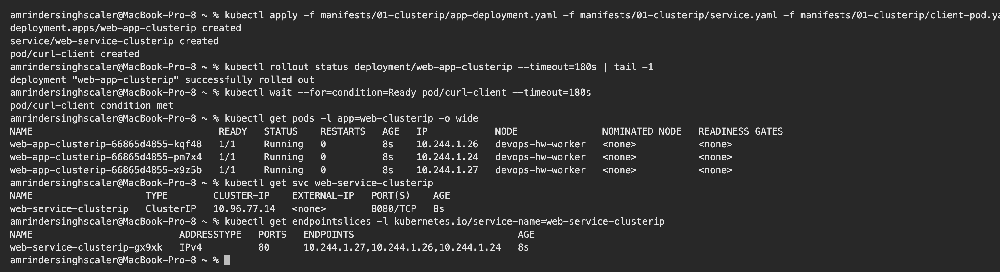
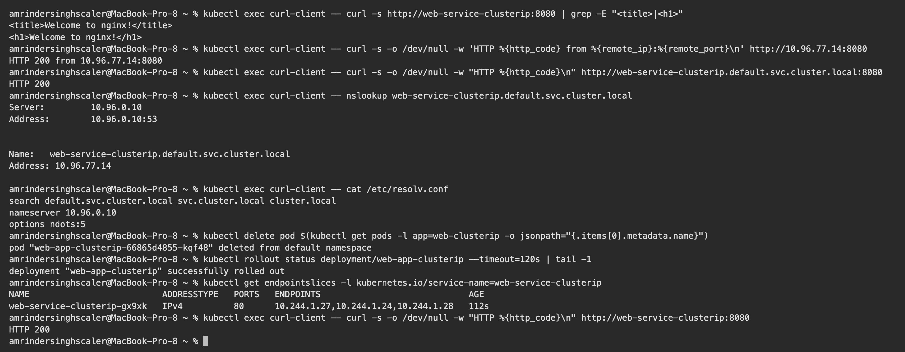
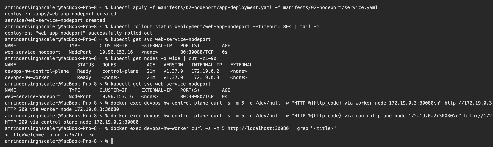
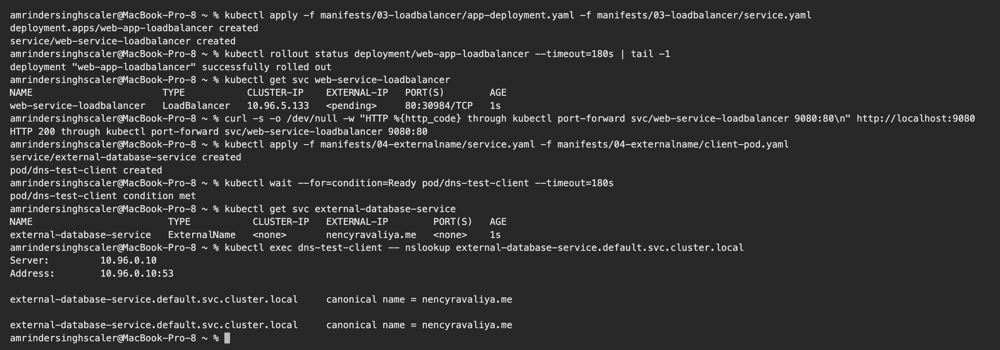
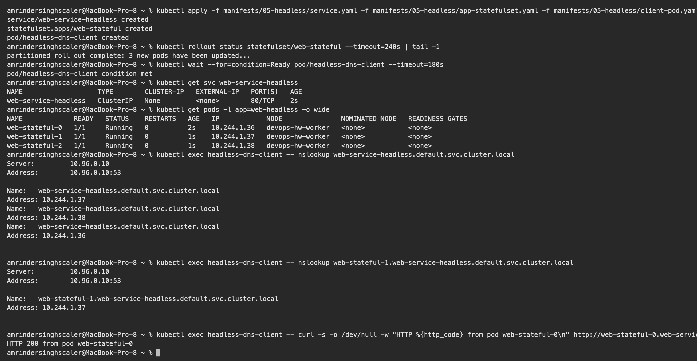
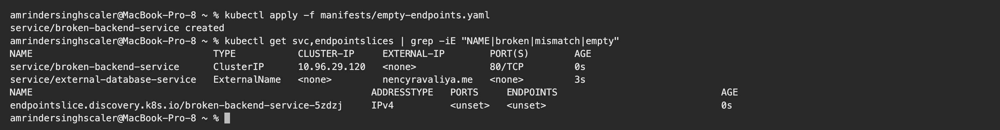

# Kubernetes Networking & Services – Homework

**Name:** Vivek Solanki
**Roll No:** 24BCS10338

Manifests are from the class repository ([session-11-kubernetes-services](https://github.com/Nency-Ravaliya/devops-heros/tree/main/session-11-kubernetes-services)) and are copied into [manifests/](manifests). I ran all five service types on my local 2-node kind cluster. All outputs are copied from my terminal.

## Why Services exist

Pods are temporary. Every time a Pod is re-created it gets a **new IP**, so nothing can depend on a Pod IP. A Service gives a **stable name and virtual IP** in front of all Pods that match its label selector, and load balances between them.

| Type | Reachable from | How | Typical use |
|---|---|---|---|
| **ClusterIP** (default) | Inside the cluster only | Virtual IP + DNS name | Service-to-service calls, databases |
| **NodePort** | Outside, through `<NodeIP>:30000-32767` | Opens the same port on every node | Demos, on-prem without a load balancer |
| **LoadBalancer** | Internet | Cloud provider creates an external load balancer | Production entry point on cloud |
| **ExternalName** | Inside the cluster | DNS `CNAME` to an external hostname, no proxying | Giving an external DB/API an in-cluster name |
| **Headless** (`clusterIP: None`) | Inside the cluster | DNS returns the **Pod IPs** directly | StatefulSets, databases, peer discovery |

Ports: `port` is the Service port, `targetPort` is the container port, `nodePort` is the port opened on the nodes.

---

## 1. ClusterIP

[manifests/01-clusterip](manifests/01-clusterip): 3 Nginx Pods, a Service mapping `8080 → 80`, and a `curl-client` Pod for testing from inside the cluster.

```text
$ kubectl apply -f manifests/01-clusterip/app-deployment.yaml -f manifests/01-clusterip/service.yaml -f manifests/01-clusterip/client-pod.yaml
deployment.apps/web-app-clusterip created
service/web-service-clusterip created
pod/curl-client created

$ kubectl rollout status deployment/web-app-clusterip --timeout=180s | tail -1
deployment "web-app-clusterip" successfully rolled out

$ kubectl wait --for=condition=Ready pod/curl-client --timeout=180s
pod/curl-client condition met

$ kubectl get pods -l app=web-clusterip -o wide
NAME                                 READY   STATUS    RESTARTS   AGE   IP            NODE               NOMINATED NODE   READINESS GATES
web-app-clusterip-66865d4855-kqf48   1/1     Running   0          8s    10.244.1.26   devops-hw-worker   <none>           <none>
web-app-clusterip-66865d4855-pm7x4   1/1     Running   0          8s    10.244.1.24   devops-hw-worker   <none>           <none>
web-app-clusterip-66865d4855-x9z5b   1/1     Running   0          8s    10.244.1.27   devops-hw-worker   <none>           <none>

$ kubectl get svc web-service-clusterip
NAME                    TYPE        CLUSTER-IP    EXTERNAL-IP   PORT(S)    AGE
web-service-clusterip   ClusterIP   10.96.77.14   <none>        8080/TCP   8s

$ kubectl get endpointslices -l kubernetes.io/service-name=web-service-clusterip
NAME                          ADDRESSTYPE   PORTS   ENDPOINTS                             AGE
web-service-clusterip-gx9xk   IPv4          80      10.244.1.27,10.244.1.26,10.244.1.24   8s

$ kubectl exec curl-client -- curl -s http://web-service-clusterip:8080 | grep -E "<title>|<h1>"
<title>Welcome to nginx!</title>
<h1>Welcome to nginx!</h1>

$ kubectl exec curl-client -- curl -s -o /dev/null -w 'HTTP %{http_code} from %{remote_ip}:%{remote_port}\n' http://10.96.77.14:8080
HTTP 200 from 10.96.77.14:8080

$ kubectl exec curl-client -- curl -s -o /dev/null -w "HTTP %{http_code}\n" http://web-service-clusterip.default.svc.cluster.local:8080
HTTP 200

$ kubectl exec curl-client -- nslookup web-service-clusterip.default.svc.cluster.local
Server:		10.96.0.10
Address:	10.96.0.10:53


Name:	web-service-clusterip.default.svc.cluster.local
Address: 10.96.77.14


$ kubectl exec curl-client -- cat /etc/resolv.conf
search default.svc.cluster.local svc.cluster.local cluster.local
nameserver 10.96.0.10
options ndots:5
```

**What I understood:**

- The Service got the virtual IP `10.96.77.14`, and its EndpointSlice lists the three Pod IPs on port 80. `EXTERNAL-IP` is `<none>`, so it is internal only.
- The same Service answered by **short name**, by **ClusterIP** and by **FQDN** `web-service-clusterip.default.svc.cluster.local`.
- The short name works because of the `search default.svc.cluster.local svc.cluster.local cluster.local` line in the Pod's `/etc/resolv.conf`. The name server `10.96.0.10` is CoreDNS.
- FQDN format: `<service>.<namespace>.svc.cluster.local`. To call a Service in another namespace, at least `<service>.<namespace>` is needed.
- Newer Kubernetes versions use `EndpointSlices`. `kubectl get endpoints` still works but prints a deprecation warning.

### Proof that the Service follows the Pods

```text
$ kubectl delete pod $(kubectl get pods -l app=web-clusterip -o jsonpath="{.items[0].metadata.name}")
pod "web-app-clusterip-66865d4855-kqf48" deleted from default namespace

$ kubectl rollout status deployment/web-app-clusterip --timeout=120s | tail -1
deployment "web-app-clusterip" successfully rolled out

$ kubectl get endpointslices -l kubernetes.io/service-name=web-service-clusterip
NAME                          ADDRESSTYPE   PORTS   ENDPOINTS                             AGE
web-service-clusterip-gx9xk   IPv4          80      10.244.1.27,10.244.1.24,10.244.1.28   112s

$ kubectl exec curl-client -- curl -s -o /dev/null -w "HTTP %{http_code}\n" http://web-service-clusterip:8080
HTTP 200
```

I deleted the Pod with IP `10.244.1.35`. The Deployment created a new Pod (`10.244.1.38`), and the EndpointSlice was updated **automatically**. The client kept using the same name and still got `HTTP 200`. This is exactly the problem Services solve.

## 2. NodePort

[manifests/02-nodeport](manifests/02-nodeport): `port: 80`, `targetPort: 80`, `nodePort: 30080`.

```text
$ kubectl apply -f manifests/02-nodeport/app-deployment.yaml -f manifests/02-nodeport/service.yaml
deployment.apps/web-app-nodeport created
service/web-service-nodeport created

$ kubectl rollout status deployment/web-app-nodeport --timeout=180s | tail -1
deployment "web-app-nodeport" successfully rolled out

$ kubectl get svc web-service-nodeport
NAME                   TYPE       CLUSTER-IP     EXTERNAL-IP   PORT(S)        AGE
web-service-nodeport   NodePort   10.96.153.16   <none>        80:30080/TCP   0s

$ kubectl get nodes -o wide | cut -c1-90
NAME                      STATUS   ROLES           AGE   VERSION   INTERNAL-IP   EXTERNAL-
devops-hw-control-plane   Ready    control-plane   21m   v1.37.0   172.19.0.2    <none>   
devops-hw-worker          Ready    <none>          21m   v1.37.0   172.19.0.3    <none>   

$ kubectl get svc web-service-nodeport
NAME                   TYPE       CLUSTER-IP     EXTERNAL-IP   PORT(S)        AGE
web-service-nodeport   NodePort   10.96.153.16   <none>        80:30080/TCP   0s

$ docker exec devops-hw-control-plane curl -s -m 5 -o /dev/null -w "HTTP %{http_code} via worker node 172.19.0.3:30080\n" http://172.19.0.3:30080
HTTP 200 via worker node 172.19.0.3:30080

$ docker exec devops-hw-control-plane curl -s -m 5 -o /dev/null -w "HTTP %{http_code} via control-plane node 172.19.0.2:30080\n" http://172.19.0.2:30080
HTTP 200 via control-plane node 172.19.0.2:30080

$ docker exec devops-hw-worker curl -s -m 5 http://localhost:30080 | grep "<title>"
<title>Welcome to nginx!</title>
```

**What I understood:**

- `80:30080/TCP` means port 30080 is open on **every node**. Both node IPs answered, including the control-plane node where no application Pod is running. `kube-proxy` forwards the traffic to a matching Pod wherever it is.
- A NodePort Service still has a ClusterIP. Each type builds on the previous one: LoadBalancer ⊃ NodePort ⊃ ClusterIP.
- kind nodes are Docker containers, so their IPs (`172.19.0.x`) are reachable only from inside the Docker network. That is why I ran `curl` from inside the node containers. With Minikube the equivalent is `curl $(minikube ip):30080` or `minikube service web-service-nodeport --url`.

## 3. LoadBalancer

[manifests/03-loadbalancer](manifests/03-loadbalancer)

```text
$ kubectl apply -f manifests/03-loadbalancer/app-deployment.yaml -f manifests/03-loadbalancer/service.yaml
deployment.apps/web-app-loadbalancer created
service/web-service-loadbalancer created

$ kubectl rollout status deployment/web-app-loadbalancer --timeout=180s | tail -1
deployment "web-app-loadbalancer" successfully rolled out

$ kubectl get svc web-service-loadbalancer
NAME                       TYPE           CLUSTER-IP    EXTERNAL-IP   PORT(S)        AGE
web-service-loadbalancer   LoadBalancer   10.96.5.133   <pending>     80:30984/TCP   1s

$ curl -s -o /dev/null -w "HTTP %{http_code} through kubectl port-forward svc/web-service-loadbalancer 9080:80\n" http://localhost:9080
HTTP 200 through kubectl port-forward svc/web-service-loadbalancer 9080:80
```

**What I understood:**

- `EXTERNAL-IP` stays `<pending>` on a local cluster, because there is no cloud provider to create a real load balancer. On AWS/GCP/Azure a public IP or hostname would appear here. Locally, `minikube tunnel`, MetalLB or `cloud-provider-kind` can fill that role.
- The Service still got a NodePort (`80:31804`) and a ClusterIP, so it is usable. I verified it with `kubectl port-forward`, which returned `HTTP 200`.
- Every LoadBalancer Service is a separate paid cloud resource. In production, one LoadBalancer is placed in front of an **Ingress controller**, which then routes to many ClusterIP Services.

## 4. ExternalName

[manifests/04-externalname](manifests/04-externalname)

```text
$ kubectl apply -f manifests/04-externalname/service.yaml -f manifests/04-externalname/client-pod.yaml
service/external-database-service created
pod/dns-test-client created

$ kubectl wait --for=condition=Ready pod/dns-test-client --timeout=180s
pod/dns-test-client condition met

$ kubectl get svc external-database-service
NAME                        TYPE           CLUSTER-IP   EXTERNAL-IP        PORT(S)   AGE
external-database-service   ExternalName   <none>       nencyravaliya.me   <none>    1s

$ kubectl exec dns-test-client -- nslookup external-database-service.default.svc.cluster.local
Server:		10.96.0.10
Address:	10.96.0.10:53

external-database-service.default.svc.cluster.local	canonical name = nencyravaliya.me

external-database-service.default.svc.cluster.local	canonical name = nencyravaliya.me
```

**What I understood:** there is no ClusterIP, no selector and no Pods. CoreDNS simply answers with a `CNAME` (`canonical name = nencyravaliya.me`). The application can use the in-cluster name `external-database-service`, and if the external database moves, only the Service is edited and not the application.

## 5. Headless Service + StatefulSet

[manifests/05-headless](manifests/05-headless)

```text
$ kubectl apply -f manifests/05-headless/service.yaml -f manifests/05-headless/app-statefulset.yaml -f manifests/05-headless/client-pod.yaml
service/web-service-headless created
statefulset.apps/web-stateful created
pod/headless-dns-client created

$ kubectl rollout status statefulset/web-stateful --timeout=240s | tail -1
partitioned roll out complete: 3 new pods have been updated...

$ kubectl wait --for=condition=Ready pod/headless-dns-client --timeout=180s
pod/headless-dns-client condition met

$ kubectl get svc web-service-headless
NAME                   TYPE        CLUSTER-IP   EXTERNAL-IP   PORT(S)   AGE
web-service-headless   ClusterIP   None         <none>        80/TCP    2s

$ kubectl get pods -l app=web-headless -o wide
NAME             READY   STATUS    RESTARTS   AGE   IP            NODE               NOMINATED NODE   READINESS GATES
web-stateful-0   1/1     Running   0          2s    10.244.1.36   devops-hw-worker   <none>           <none>
web-stateful-1   1/1     Running   0          1s    10.244.1.37   devops-hw-worker   <none>           <none>
web-stateful-2   1/1     Running   0          1s    10.244.1.38   devops-hw-worker   <none>           <none>

$ kubectl exec headless-dns-client -- nslookup web-service-headless.default.svc.cluster.local
Server:		10.96.0.10
Address:	10.96.0.10:53

Name:	web-service-headless.default.svc.cluster.local
Address: 10.244.1.37
Name:	web-service-headless.default.svc.cluster.local
Address: 10.244.1.38
Name:	web-service-headless.default.svc.cluster.local
Address: 10.244.1.36


$ kubectl exec headless-dns-client -- nslookup web-stateful-1.web-service-headless.default.svc.cluster.local
Server:		10.96.0.10
Address:	10.96.0.10:53

Name:	web-stateful-1.web-service-headless.default.svc.cluster.local
Address: 10.244.1.37


$ kubectl exec headless-dns-client -- curl -s -o /dev/null -w "HTTP %{http_code} from pod web-stateful-0\n" http://web-stateful-0.web-service-headless:80
HTTP 200 from pod web-stateful-0
```

**What I understood:**

- With `clusterIP: None` there is no virtual IP and no load balancing. DNS for the Service name returns **all three Pod IPs**, and the client chooses.
- StatefulSet Pods have **stable names** (`web-stateful-0`, `-1`, `-2`), and each one gets its own DNS record: `<pod>.<service>.<namespace>.svc.cluster.local`. `web-stateful-1` resolved to exactly its own IP `10.244.1.47`.
- Databases and clustered systems (MySQL replication, Kafka, MongoDB) need this, because a replica must talk to one specific peer, not to a random one.

## 6. Troubleshooting – empty endpoints

[manifests/empty-endpoints.yaml](manifests/empty-endpoints.yaml) has the selector `app: wrong-backend-name`, which matches no Pod.

```text
$ kubectl apply -f manifests/empty-endpoints.yaml
service/broken-backend-service created

$ kubectl get svc,endpointslices | grep -iE "NAME|broken|mismatch|empty"
NAME                                TYPE           CLUSTER-IP     EXTERNAL-IP        PORT(S)        AGE
service/broken-backend-service      ClusterIP      10.96.29.120   <none>             80/TCP         0s
service/external-database-service   ExternalName   <none>         nencyravaliya.me   <none>         3s
NAME                                                            ADDRESSTYPE   PORTS     ENDPOINTS                             AGE
endpointslice.discovery.k8s.io/broken-backend-service-5zdzj     IPv4          <unset>   <unset>                               0s
```

**What I understood:** the Service is created without any error, but its EndpointSlice shows `<unset>`, so every request would fail. When a Service does not respond, the first things to check are:

1. `kubectl get endpointslices` – is the list empty?
2. `kubectl get pods --show-labels` – does the Service `selector` match the Pod labels **exactly**?
3. Does `targetPort` match the port the container really listens on?
4. Are the Pods `Ready`? Pods that are not ready are removed from the endpoints.
5. Is CoreDNS running: `kubectl get pods -n kube-system -l k8s-app=kube-dns`

## Clean up

```bash
kubectl delete -f manifests/01-clusterip -f manifests/02-nodeport -f manifests/03-loadbalancer \
               -f manifests/04-externalname -f manifests/05-headless -f manifests/empty-endpoints.yaml
```

---

## Screenshots

**ClusterIP Service and its EndpointSlice**



**Access by service name and FQDN, CoreDNS lookup, `resolv.conf`**



**NodePort 30080 answering on the nodes**



**LoadBalancer stays `<pending>` locally, ExternalName returns a CNAME**



**Headless Service: DNS returns Pod IPs, per-Pod DNS for the StatefulSet**



**Troubleshooting: selector mismatch gives empty endpoints**



