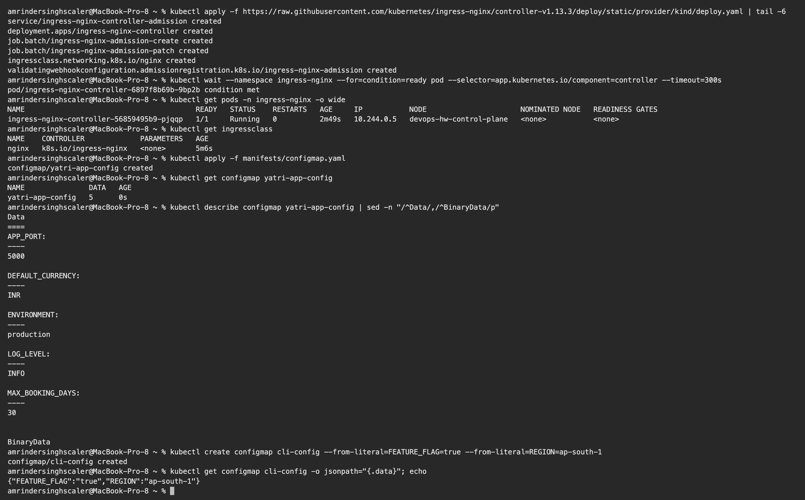
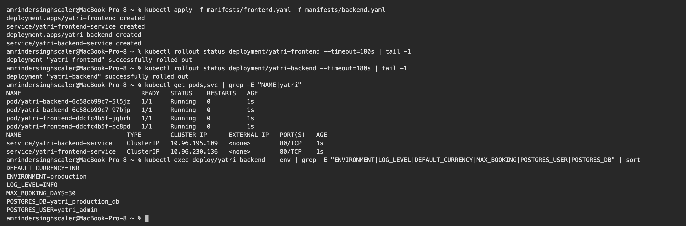
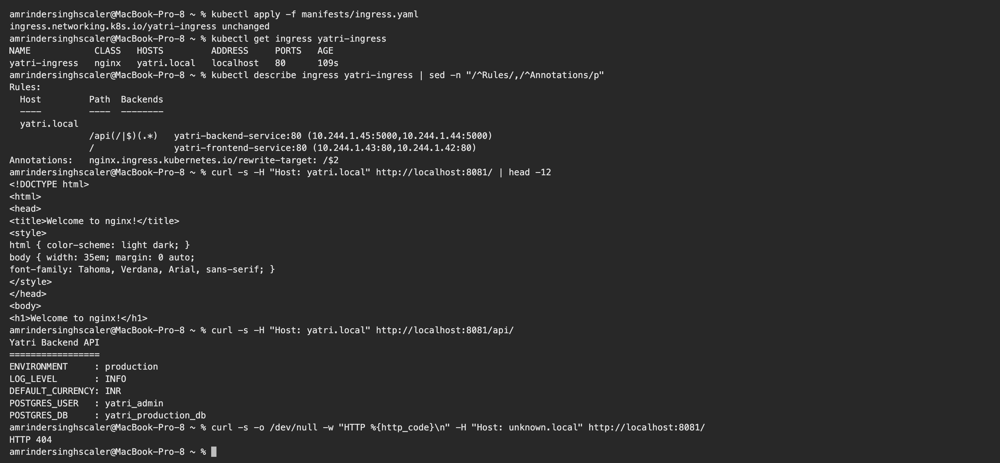

# Kubernetes Ingress, ConfigMaps & Secrets – Homework

**Name:** Vivek Solanki
**Roll No:** 24BCS10338

Manifests are from the class repository ([session-12-ingress-configmaps-secrets/04-full-demo](https://github.com/Nency-Ravaliya/devops-heros/tree/main/session-12-ingress-configmaps-secrets/04-full-demo)) and are copied into [manifests/](manifests). I ran them on my local kind cluster. All outputs are copied from my terminal.

| Object | Purpose |
|---|---|
| **ConfigMap** | Non-sensitive configuration as key-value pairs, kept outside the image |
| **Secret** | Sensitive values (passwords, tokens, TLS keys), stored base64-encoded |
| **Ingress** | HTTP/HTTPS routing rules (host and path) from one entry point to many Services |
| **Ingress Controller** | The actual reverse proxy (here NGINX) that reads Ingress objects and applies them |

What gets built:

```text
                       Host: yatri.local
 curl / browser ─────────────► NGINX Ingress Controller
                                   │
                  path /           │           path /api/...
                  ▼                                ▼
      yatri-frontend-service            yatri-backend-service     (ClusterIP)
                  ▼                                ▼
        2 × Nginx Pods                  2 × Python API Pods
                                         ▲               ▲
                                  ConfigMap            Secret
                               yatri-app-config    yatri-db-secret
```

---

## 0. Install the Ingress controller

The class demo uses `minikube addons enable ingress`. On kind the same NGINX controller is installed from its official manifest. My kind cluster maps the node's port 80 to `localhost:8081` on my laptop (see [kind-cluster.yaml](../08_Kubernetes_Fundamentals/kind-cluster.yaml)).

```text
$ kubectl apply -f https://raw.githubusercontent.com/kubernetes/ingress-nginx/controller-v1.13.3/deploy/static/provider/kind/deploy.yaml | tail -6
service/ingress-nginx-controller-admission created
deployment.apps/ingress-nginx-controller created
job.batch/ingress-nginx-admission-create created
job.batch/ingress-nginx-admission-patch created
ingressclass.networking.k8s.io/nginx created
validatingwebhookconfiguration.admissionregistration.k8s.io/ingress-nginx-admission created

$ kubectl wait --namespace ingress-nginx --for=condition=ready pod --selector=app.kubernetes.io/component=controller --timeout=300s
pod/ingress-nginx-controller-6897f8b69b-9bp2b condition met
```

On kind the controller must run on the node that has the mapped ports (the one labelled `ingress-ready=true`), so I pinned it there:

```bash
kubectl -n ingress-nginx patch deploy ingress-nginx-controller --type merge \
  -p '{"spec":{"template":{"spec":{"nodeSelector":{"kubernetes.io/os":"linux","ingress-ready":"true"}}}}}'
```

```text
$ kubectl get pods -n ingress-nginx -o wide
NAME                                        READY   STATUS    RESTARTS   AGE     IP           NODE                      NOMINATED NODE   READINESS GATES
ingress-nginx-controller-56859495b9-pjqqp   1/1     Running   0          2m49s   10.244.0.5   devops-hw-control-plane   <none>           <none>

$ kubectl get ingressclass
NAME    CONTROLLER             PARAMETERS   AGE
nginx   k8s.io/ingress-nginx   <none>       5m6s
```

## 1. ConfigMap

[manifests/configmap.yaml](manifests/configmap.yaml)

```text
$ kubectl apply -f manifests/configmap.yaml
configmap/yatri-app-config created

$ kubectl get configmap yatri-app-config
NAME               DATA   AGE
yatri-app-config   5      0s

$ kubectl describe configmap yatri-app-config | sed -n "/^Data/,/^BinaryData/p"
Data
====
APP_PORT:
----
5000

DEFAULT_CURRENCY:
----
INR

ENVIRONMENT:
----
production

LOG_LEVEL:
----
INFO

MAX_BOOKING_DAYS:
----
30


BinaryData

$ kubectl create configmap cli-config --from-literal=FEATURE_FLAG=true --from-literal=REGION=ap-south-1
configmap/cli-config created

$ kubectl get configmap cli-config -o jsonpath="{.data}"; echo
{"FEATURE_FLAG":"true","REGION":"ap-south-1"}
```

**What I understood:** a ConfigMap is plain text and can be created from YAML or directly from the CLI (`--from-literal`, `--from-file`). The same image can run in dev and production with different ConfigMaps, so configuration changes do not need an image rebuild.

## 2. Secret

[manifests/secret.yaml](manifests/secret.yaml)

```text
$ kubectl apply -f manifests/secret.yaml
secret/yatri-db-secret created

$ kubectl get secret yatri-db-secret
NAME              TYPE     DATA   AGE
yatri-db-secret   Opaque   3      0s

$ kubectl describe secret yatri-db-secret | sed -n "/^Type/,\$p"
Type:  Opaque

Data
====
POSTGRES_DB:        19 bytes
POSTGRES_PASSWORD:  14 bytes
POSTGRES_USER:      11 bytes

$ kubectl get secret yatri-db-secret -o jsonpath="{.data.POSTGRES_USER}"; echo
eWF0cmlfYWRtaW4=

$ kubectl get secret yatri-db-secret -o jsonpath="{.data.POSTGRES_USER}" | base64 --decode; echo
yatri_admin

$ echo -n "yatri_admin" | base64
eWF0cmlfYWRtaW4=

$ echo "yatri_admin" | base64
eWF0cmlfYWRtaW4K
```

**What I understood:**

- `kubectl describe secret` shows only the **size** of each value, never the value.
- Values under `data:` are **base64-encoded, not encrypted**. Anyone who can read the Secret can decode it with `base64 --decode`. Real protection comes from RBAC, encryption at rest for etcd, and keeping Secret YAML out of Git (or using Sealed Secrets / an external vault).
- **The base64 gotcha:** `echo -n "yatri_admin" | base64` gives `eWF0cmlfYWRtaW4=`, but without `-n` the result is `eWF0cmlfYWRtaW4K`. The trailing `K` is an encoded newline. That hidden newline ends up inside the password and causes login failures that are very hard to spot. Always use `echo -n`, or use `stringData:` and let Kubernetes do the encoding.

## 3. Deploy the applications and inject the configuration

[manifests/frontend.yaml](manifests/frontend.yaml), [manifests/backend.yaml](manifests/backend.yaml)

The backend uses both injection styles:

```yaml
envFrom:
  - configMapRef:
      name: yatri-app-config          # every key becomes an environment variable
env:
  - name: POSTGRES_USER
    valueFrom:
      secretKeyRef:                   # one specific key from the Secret
        name: yatri-db-secret
        key: POSTGRES_USER
```

```text
$ kubectl apply -f manifests/frontend.yaml -f manifests/backend.yaml
deployment.apps/yatri-frontend created
service/yatri-frontend-service created
deployment.apps/yatri-backend created
service/yatri-backend-service created

$ kubectl rollout status deployment/yatri-frontend --timeout=180s | tail -1
deployment "yatri-frontend" successfully rolled out

$ kubectl rollout status deployment/yatri-backend --timeout=180s | tail -1
deployment "yatri-backend" successfully rolled out

$ kubectl get pods,svc | grep -E "NAME|yatri"
NAME                                 READY   STATUS    RESTARTS   AGE
pod/yatri-backend-6c58cb99c7-5l5jz   1/1     Running   0          1s
pod/yatri-backend-6c58cb99c7-97bjp   1/1     Running   0          1s
pod/yatri-frontend-ddcfc4b5f-jqbrh   1/1     Running   0          1s
pod/yatri-frontend-ddcfc4b5f-pc8pd   1/1     Running   0          1s
NAME                             TYPE        CLUSTER-IP      EXTERNAL-IP   PORT(S)   AGE
service/yatri-backend-service    ClusterIP   10.96.195.109   <none>        80/TCP    1s
service/yatri-frontend-service   ClusterIP   10.96.230.136   <none>        80/TCP    1s

$ kubectl exec deploy/yatri-backend -- env | grep -E "ENVIRONMENT|LOG_LEVEL|DEFAULT_CURRENCY|MAX_BOOKING|POSTGRES_USER|POSTGRES_DB" | sort
DEFAULT_CURRENCY=INR
ENVIRONMENT=production
LOG_LEVEL=INFO
MAX_BOOKING_DAYS=30
POSTGRES_DB=yatri_production_db
POSTGRES_USER=yatri_admin
```

**What I understood:** inside the container the ConfigMap keys and the **decoded** Secret values are ordinary environment variables. The application does not need to know Kubernetes exists. Environment variables are read only at start-up, so after changing a ConfigMap the Pods need `kubectl rollout restart deployment/<name>`. ConfigMaps mounted as volumes are refreshed automatically.

## 4. Ingress

[manifests/ingress.yaml](manifests/ingress.yaml): host `yatri.local`, `/api(/|$)(.*)` → backend with `rewrite-target: /$2`, and `/` → frontend.

Instead of editing `/etc/hosts`, I sent the `Host` header with `curl`. The result is the same, because the Ingress controller routes based on that header.

```text
$ kubectl apply -f manifests/ingress.yaml
ingress.networking.k8s.io/yatri-ingress unchanged

$ kubectl get ingress yatri-ingress
NAME            CLASS   HOSTS         ADDRESS     PORTS   AGE
yatri-ingress   nginx   yatri.local   localhost   80      109s

$ kubectl describe ingress yatri-ingress | sed -n "/^Rules/,/^Annotations/p"
Rules:
  Host         Path  Backends
  ----         ----  --------
  yatri.local  
               /api(/|$)(.*)   yatri-backend-service:80 (10.244.1.45:5000,10.244.1.44:5000)
               /               yatri-frontend-service:80 (10.244.1.43:80,10.244.1.42:80)
Annotations:   nginx.ingress.kubernetes.io/rewrite-target: /$2

$ curl -s -H "Host: yatri.local" http://localhost:8081/ | head -12
<!DOCTYPE html>
<html>
<head>
<title>Welcome to nginx!</title>
<style>
html { color-scheme: light dark; }
body { width: 35em; margin: 0 auto;
font-family: Tahoma, Verdana, Arial, sans-serif; }
</style>
</head>
<body>
<h1>Welcome to nginx!</h1>

$ curl -s -H "Host: yatri.local" http://localhost:8081/api/
Yatri Backend API
=================
ENVIRONMENT     : production
LOG_LEVEL       : INFO
DEFAULT_CURRENCY: INR
POSTGRES_USER   : yatri_admin
POSTGRES_DB     : yatri_production_db

$ curl -s -o /dev/null -w "HTTP %{http_code}\n" -H "Host: unknown.local" http://localhost:8081/
HTTP 404
```

**What I understood:**

- **One entry point, two Services.** `/` returned the Nginx frontend page and `/api/` returned the backend API. Both Services are plain ClusterIP, so nothing else is exposed.
- The backend response contains `ENVIRONMENT: production` and `DEFAULT_CURRENCY: INR` from the **ConfigMap**, and `POSTGRES_USER: yatri_admin` from the **Secret**. That proves the whole chain works: Ingress → Service → Pod → configuration.
- `rewrite-target: /$2` removes the `/api` prefix, so the backend receives `/` instead of `/api/`.
- A request with an unknown host (`unknown.local`) got `404` from the controller's default backend, because no rule matches it. Routing really is host based.
- `ingressClassName: nginx` selects which controller handles the Ingress. An Ingress object without a running controller does nothing.
- Compared to one LoadBalancer per Service, Ingress needs a single external IP and adds path/host routing and TLS termination in one place.

## 5. Clean up

```bash
kubectl delete -f manifests/
kubectl delete configmap cli-config
```

---

## Screenshots

**Ingress controller running, ConfigMap applied**



**Secret: describe hides values, base64 decode, and the `echo -n` gotcha**


**Apps deployed, ConfigMap and Secret values visible as environment variables**



**Ingress routing: `/` → frontend, `/api/` → backend, unknown host → 404**



**Browser: `http://yatri.local:8081/` (frontend through the Ingress)**


**Browser: `http://yatri.local:8081/api/` (backend showing ConfigMap and Secret values)**


